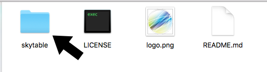

# Coronium SkyTable

___A performant and secure user scoped table datastore and client for use with [Corona](https://coronalabs.com).___

---

## Get The Client

First point your browser to the __[Coronium SkyTable Client GitHub repo](https://github.com/develephant/coronium-skytable-client)__.

Next, click the __Clone or Download__ button and select __Download ZIP__, then select a location on your computer.


Expand the __coronium-skytable-client-master.zip__ file and navigate to the __coronium-skytable-client-master__ directory.



Copy the __skytable__ directory to the root of your Corona project. The project tree should look similar to:

```
CoronaProject/
  skytable
  main.lua
  ...
```

---

## Adding The Client

Once you have the __skytable__ directory in your project, open your __main.lua__ file and add the following:

```lua
local skytable = require('skytable.client')
```

Now you're ready to get started. See the __[Client API](client-api)__ and __[Client Guide](client-guide)__ to start using Coronium SkyTable.