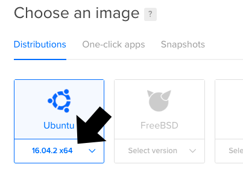

__Coronium SkyTable__ runs best on a __[DigitalOcean](https://m.do.co/c/cddeeddbbdb8) Ubuntu 16.04__ droplet.

!!! tip
    If you're new to [DigitalOcean](https://m.do.co/c/cddeeddbbdb8) please consider signing up with __[this link](https://m.do.co/c/cddeeddbbdb8)__. Not only will you receive a $10 credit (2 free months), but it also helps support the continued development, and testing of __Coronium SkyTable__.

!!! note "Screencast"
    View the installation instructions in a screencast format by [clicking here](https://www.youtube.com/watch?v=8Lx0ko2s6fY).


### Create A Droplet

Once you log into your [DigitalOcean](https://m.do.co/c/cddeeddbbdb8) account, click the __Create__ button and select __Droplets__ from the menu.


On the next screen, first select a __Ubuntu 16.04__ droplet distribution.

 

Select your preferred droplet size. A __512MB/1 CPU__ droplet is a good starting point. You can always increase the size later.


Next, select a region for the droplet. Consider choosing a location closest to your most active user base.


Select your SSH profile to attach to the droplet.


!!! caution
    There is an option where you can use a password instead of an SSH key, which may be easier if you're only testing __Coronium SkyTable__, though I wouldn't recommend it. You can learn more about generating SSH keys for [DigitalOcean](https://m.do.co/c/cddeeddbbdb8) here: [Creating SSH Keys](https://www.digitalocean.com/community/tutorials/how-to-use-ssh-keys-with-digitalocean-droplets).

Now give your droplet a hostname.


_Be sure to replace __skytable.develephant.com__ with your own hostname._

And finally, click the __Create__ button to spin up the droplet.


### Install SkyTable

Once your droplet is done spinning up, note the ip address.


Using a terminal/shell of your choice, SSH into the droplet.

!!! tip
    You can use the built in shells on both OSX and Linux. For Windows, check out __[PuTTY](https://www.chiark.greenend.org.uk/~sgtatham/putty/latest.html)__.

```
ssh root@<your-instance-ip>
```

_Replace __<your-instance-ip\>__ with the address that was assigned to your droplet._

Once you are connected to the droplet, copy and paste the following line into the terminal:

`curl -LO https://s3.amazonaws.com/coronium-skytable/up.sh && sudo bash ./up.sh`

Once the installation is complete, __Coronium SkyTable__ is ready for action. Log out of the server by typing __exit__ on the command line.

!!! tip "Upgrade to HTTPS"
    Now is a good time to secure your SkyTable server using HTTPS. See the __[HTTPS/SSL](/ssl)__ section of the documentation.